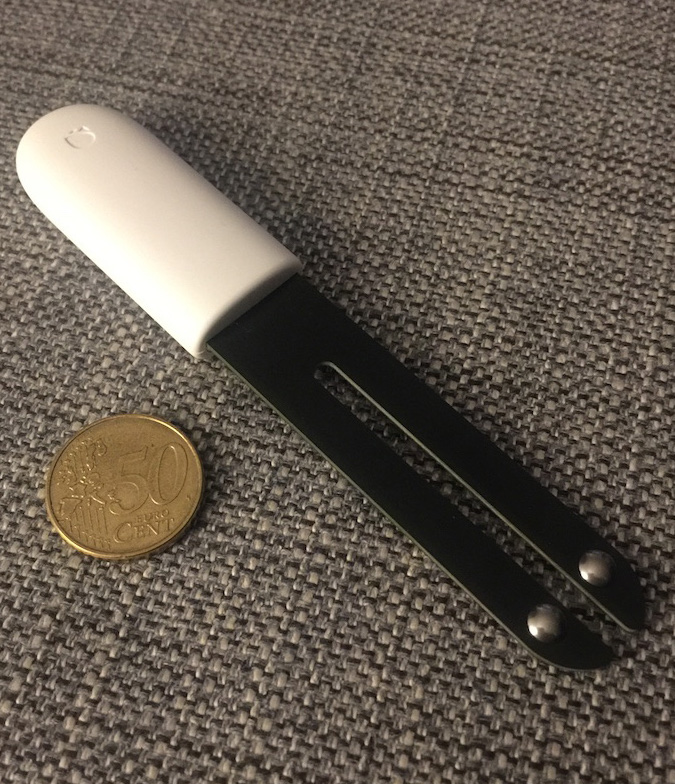

# homebridge-xiaomi-plant-monitor

This is a [Homebridge](https://github.com/nfarina/homebridge) plugin for exposing the Xiaomi Flower Care / Flower Mate / Flower Monitor / Mi Flora devices to HomeKit



## Prerequisite

This plugin is using [node-mi-flora](https://github.com/demirhanaydin/node-mi-flora) / [Noble](https://github.com/noble/noble) in the background with the same package dependencies. You can install these dependencies using `apt-get`, if not already done.

```
(sudo) apt-get install bluetooth bluez libbluetooth-dev libudev-dev
```

For more details and descriptions for other platforms see the [Noble documentation](https://github.com/noble/noble#readme). At the moment [Noble](https://www.npmjs.com/package/noble) does not support [Node 10](https://github.com/noble/node-bluetooth-hci-socket/issues/84). Please use Node 9 if you want to use this plugin, untis the issues with Noble are resolved.

## Docker 

This plugin work on docker I made a PR with a working configuration here: https://github.com/oznu/docker-homebridge/pull/211


#### MAC address

Ensure you know the MAC address of your Xiaomi Flower Care. You can use `hcitool lescan` to scan for devices. The device will appear as `AA:BB:CC:DD:EE:FF Flower care` in the list.

### npm

```
(sudo) npm install -g --unsafe-perm homebridge-xiaomi-plant-monitor
```

## Known Issues


## Example Configuration

```
{
    "accessory": "xiaomi-plant-monitor",
    "name": "My plant name",
    "macAddress": "C4:EC:0D:6A:6F:DE",
    "scanDurationInMs": 60000,
    "fetchDataIntervalInMs": 3600000
}
``` 
